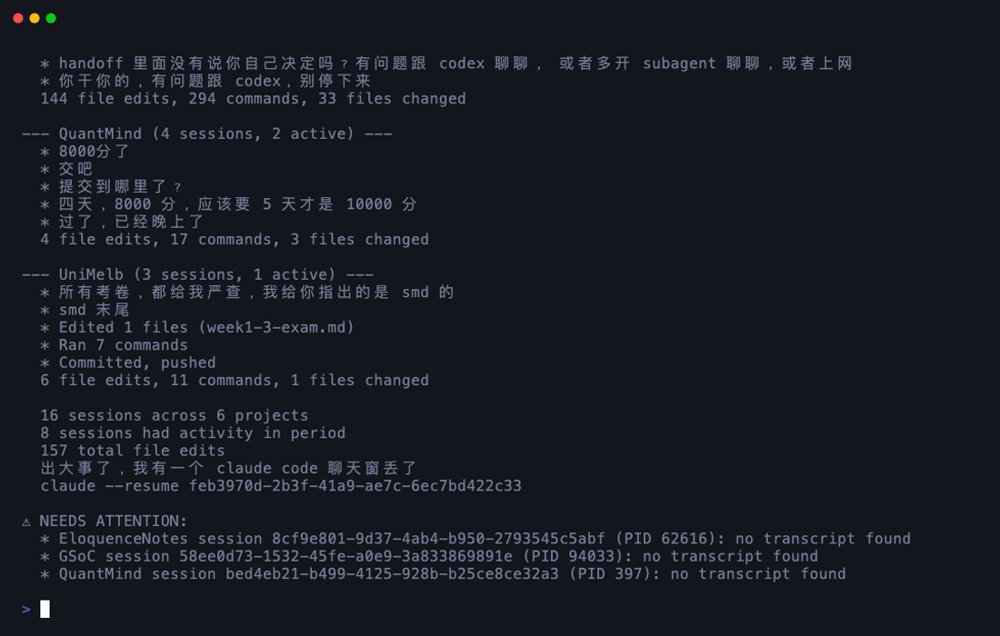
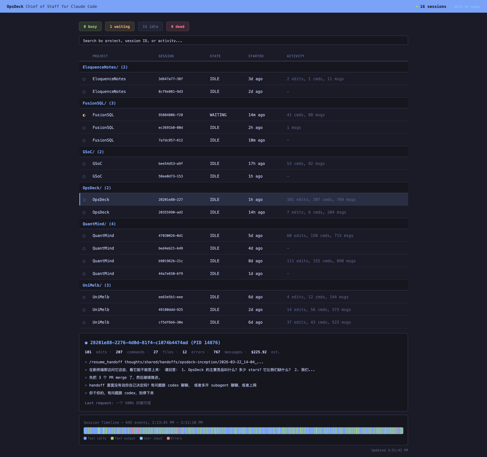

# OpsDeck

**Chief of Staff for Claude Code** — monitor all your sessions from a single terminal.



Running 8+ Claude Code sessions? Lost track of which one is waiting for you,
which one is still working, and which one crashed 20 minutes ago?

OpsDeck gives you a real-time TUI dashboard, a browser-based web dashboard,
daily briefs, productivity metrics, cost analytics, and an AI-powered morning
summary — all from a single Go binary with zero config.

```
 OpsDeck                                               12 sessions | 3 projects
--------------------------------------------------------------------------------
  PROJECT          SESSION     STATE      STARTED    LAST ACTIVITY
--------------------------------------------------------------------------------

  opsdeck/
    abc1234         PID 9812   BUSY       14:02      Implementing TUI styles
    def5678         PID 9834   WAITING    13:45      Tests passing, awaiting input

  my-api/
    fed8765         PID 8201   BUSY       12:30      Refactoring auth middleware
    cba4321         PID 8244   BUSY       12:32      Writing integration tests
    aaa1111         PID 8290   IDLE       11:15      Last: updated README
    bbb2222         PID 8301   DEAD        9:40      --

  frontend/
    cc33333         PID 7100   WAITING    14:10      Waiting for approval
    dd44444         PID 7112   BUSY       14:08      Running test suite
    ee55555         PID 7150   IDLE       10:22      Last: fixed CSS layout
    ff66666         PID 7200   DEAD        8:15      --
    gg77777         PID 7250   WAITING    13:55      Ready for next task
    hh88888         PID 7300   BUSY       14:12      Deploying to staging

--------------------------------------------------------------------------------
  j/k navigate | / search | 1 waiting 2 busy 3 idle 4 dead | Tab view | q quit
```

## Install

```bash
# Homebrew (macOS / Linux)
brew install getopsdeck/tap/opsdeck

# Or with Go
go install github.com/getopsdeck/opsdeck/cmd/opsdeck@latest
```

Requires Go 1.26+ for source builds. No other dependencies.

## Quick Start

```bash
opsdeck
```

That is it. No config files, no setup, no flags. OpsDeck finds your Claude Code
sessions automatically and starts showing them.

## Commands

```bash
# Real-time TUI dashboard (default)
opsdeck

# Daily briefing — what happened across all your projects
opsdeck brief
opsdeck brief --since 2h    # last 2 hours only
opsdeck brief --since 48h   # last 2 days

# Productivity metrics — today vs yesterday comparison
opsdeck metrics

# List all sessions — compact overview
opsdeck list               # or: opsdeck ls

# Cost analytics — token usage and estimated spend (via ccusage)
opsdeck costs
opsdeck costs --since 2h   # last 2 hours only

# AI-powered brief — natural language morning summary (opt-in, costs tokens)
opsdeck ai-brief

# Resume a session — opens claude --resume in the session's directory
opsdeck resume <session-id>
opsdeck resume 2820          # prefix match

# Watch mode — monitor sessions, alert on state changes
opsdeck watch                # macOS desktop notifications included

# Web dashboard — browser-based UI with real-time updates
opsdeck web                # opens http://localhost:7070
opsdeck web :8080          # custom port

# Version
opsdeck version
```

## Features

- **Auto-discovery** -- finds all Claude Code sessions on your machine by
  scanning `~/.claude/sessions/` and the sessions index
- **Real-time status** -- classifies each session as busy (active in last 30s),
  waiting (30s--5min, likely needs you), idle (5min+), or dead (process gone)
- **Project grouping** -- sessions are grouped by working directory so you can
  see all sessions for a given project at a glance
- **Keyboard driven** -- vi-style navigation (j/k), search (/), numeric state
  filters (1--4), tab to switch views
- **Auto-refresh** -- dashboard updates every 3 seconds; press `r` to force
- **Zero config** -- no YAML, no ENV vars, no API keys
- **Read-only** -- OpsDeck only reads session data; it never modifies sessions
  or sends signals to processes
- **Local-only** -- all data stays on your machine; nothing is sent anywhere
- **Web dashboard** -- `opsdeck web` opens a browser-based view with SSE
  real-time updates, same data, same dark theme

### Web Dashboard



## Keyboard Shortcuts

| Key       | Action                          |
|-----------|---------------------------------|
| `j` / `k` | Move cursor down / up          |
| `Enter`   | Toggle detail panel for session |
| `/`        | Start search                   |
| `Esc`      | Cancel search / clear filter   |
| `1`        | Filter: waiting sessions       |
| `2`        | Filter: busy sessions          |
| `3`        | Filter: idle sessions          |
| `4`        | Filter: dead sessions          |
| `0`        | Clear state filter             |
| `Tab`      | Toggle project / flat view     |
| `r`        | Force refresh                  |
| `q`        | Quit                           |

## How It Works

OpsDeck reads three data sources, all local and read-only:

1. **Session files** (`~/.claude/sessions/<id>/session.json`) -- each file
   contains the session ID, PID, and working directory
2. **Sessions index** (`~/.claude/sessions/sessions-index.json`) -- provides
   summaries and message counts
3. **Transcripts** (`~/.claude/sessions/<id>/transcript.jsonl`) -- the last
   entry's timestamp determines activity recency

Process liveness is checked via `kill -0` (macOS/Linux), which only tests
whether the PID exists -- it does not send any signal to the process.

State classification:

| State     | Meaning                                    |
|-----------|--------------------------------------------|
| `BUSY`    | Process alive, activity within last 30s    |
| `WAITING` | Process alive, activity 30s--5min ago      |
| `IDLE`    | Process alive, no activity for 5min+       |
| `DEAD`    | Process no longer running                  |

## Roadmap

- **v0.1** -- Core TUI dashboard + daily brief + productivity metrics
- **v0.3** -- Web dashboard with SSE real-time updates
- **v0.4** -- Cost analytics: token usage and estimated spend per session
- **v0.5** -- AI-powered brief via `claude -p` (current)

## Privacy

OpsDeck never sends data anywhere. It reads local session files on disk and
checks process liveness via the OS. There is no network access, no telemetry,
no analytics. Everything stays on your machine.

## Comparison

| Feature                   | OpsDeck | claude-squad | ccusage | Claud-ometer |
|---------------------------|---------|--------------|---------|--------------|
| Real-time TUI dashboard   | Yes     | Yes          | No      | No           |
| Web dashboard             | Yes     | No           | No      | No           |
| Auto-discovers sessions   | Yes     | No (managed) | Yes     | Yes          |
| Session state detection   | Yes     | Yes          | No      | Partial      |
| Project grouping          | Yes     | No           | No      | No           |
| Daily brief               | Yes     | No           | No      | No           |
| Productivity metrics      | Yes     | No           | No      | No           |
| Session activity detail   | Yes     | No           | No      | No           |
| Session timeline           | Yes     | No           | No      | No           |
| Git branch / status       | Yes     | No           | No      | No           |
| AI-powered brief          | Yes     | No           | No      | No           |
| Zero config               | Yes     | No           | Yes     | Yes          |
| Read-only / non-invasive  | Yes     | No (manages) | Yes     | Yes          |
| Cost analytics            | Yes     | No           | Yes     | Yes          |
| Keyboard navigation       | Yes     | Yes          | No      | No           |

OpsDeck is designed to complement your existing workflow. It does not manage or
spawn sessions -- it observes them. Use it alongside claude-squad or on its own.

## Requirements

- macOS or Linux (Windows support planned for a future release)
- Claude Code installed (OpsDeck reads its session files)

## Contributing

Contributions are welcome.

1. Fork the repository
2. Create a feature branch (`git checkout -b feature/my-change`)
3. Write tests first, then implement (`make test`)
4. Ensure `make lint` passes
5. Open a pull request

Please open an issue before starting work on large changes.

## License

MIT
